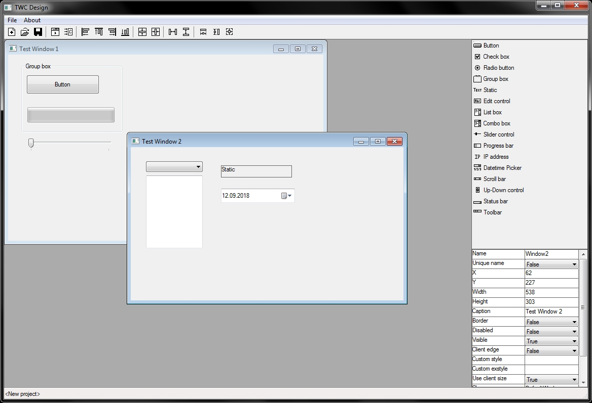

# Tiny Window Creator
Lightweight GUI designer & framework(soon) for Windows.

## Features:
* Create any number of windows and controls on them
* Size, move, copy/paste any control or control group
* Edit properties of windows and controls: 16 controls (widgets) with  set of properties + some common properties
* Save/load project to/from file
* Generate code in C programming language
* Window preview

## How to build
To build TWC you will need Visual Studio 2008.
